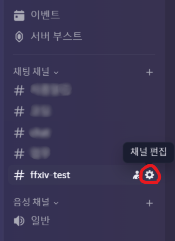
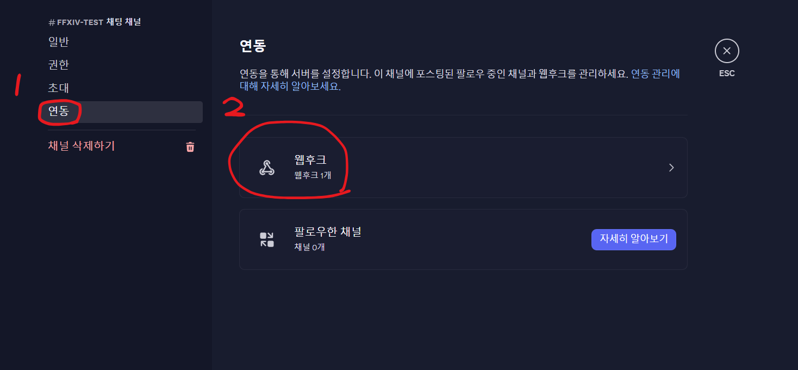
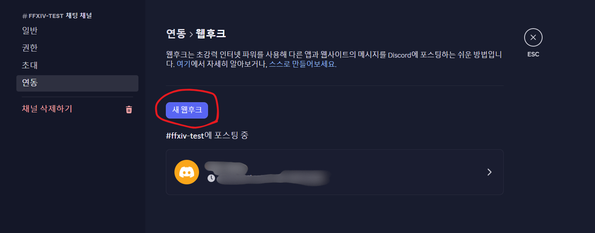
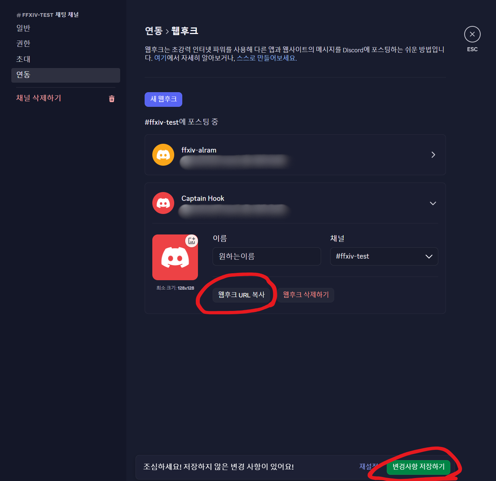
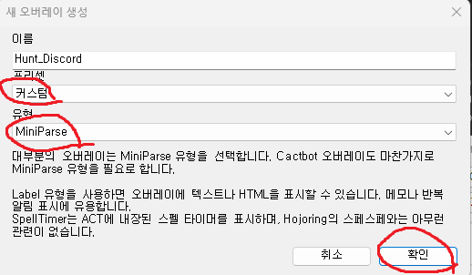
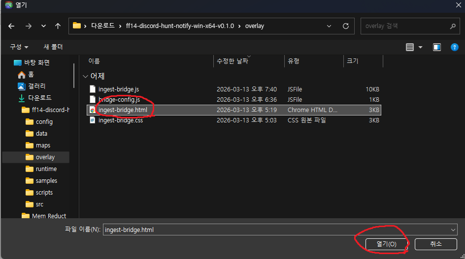
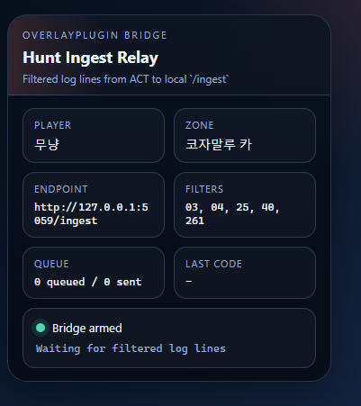
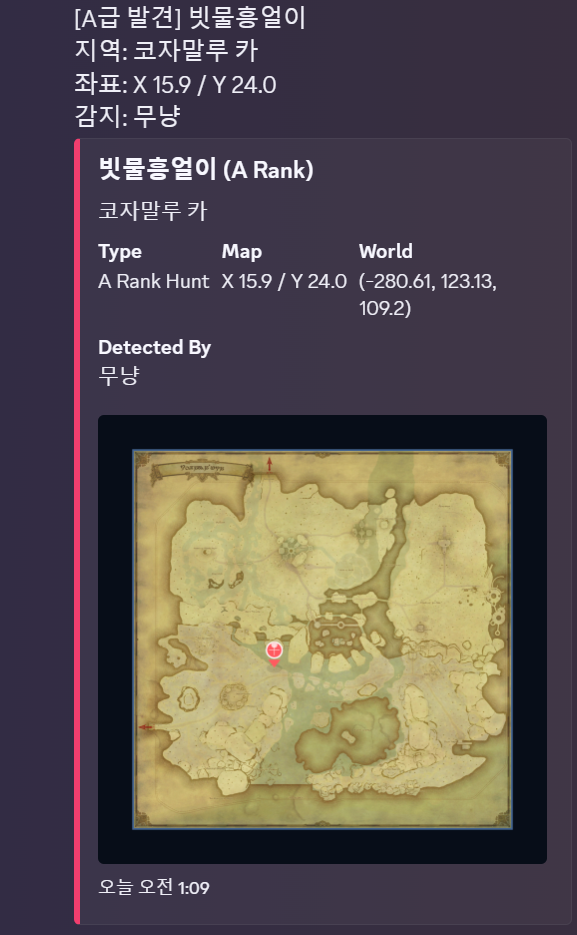

# FFXIV 황금 마물 디스코드 알림기

황금 지역 A/S급 마물을 발견하면 디스코드 웹훅으로 알림을 보내주는 로컬 실행형 프로그램입니다.

- 지역 / 좌표 표시
- 지도 이미지에 핀 찍어서 첨부

주의: 이 프로젝트는 아직 **충분한 검증이 끝나지 않은 프로토타입**입니다.
실사용 전 반드시 직접 테스트해 주세요.

## 전체 흐름

```
디스코드 웹훅 만들기 → 설정 파일 만들기 → 프로그램 실행 → ACT 오버레이 등록
```

네 단계를 **모두** 해야 알림이 옵니다.

---

## 단계 1: 디스코드 웹훅 만들기

알림을 받을 디스코드 채널에서 웹훅을 만듭니다.

1. 채널 이름 옆 톱니바퀴(설정) 클릭



2. `연동` → `웹훅` 클릭



3. `새 웹훅` 클릭



4. `웹훅 URL 복사` 클릭 후 저장



이 URL을 다음 단계에서 설정 파일에 붙여넣습니다.

---

## 단계 2: 설정 파일 만들기

`config/local.config.example.json` 을 복사해서 `config/local.config.json` 으로 만듭니다.


```json
{
  "server": {
    "host": "127.0.0.1",
    "port": 5059
  },
  "identity": {
    "detectedBy": "무냥@초코보",
    "instanceLabel": ""
  },
  "discord": {
    "webhookUrl": "https://discord.com/api/webhooks/여기에_본인_웹훅"
  },
  "storage": {
    "recordsPath": "../data/records.jsonl",
    "imageOutputDir": "../data/images",
    "dedupeMinutes": 5
  }
}
```

꼭 바꿔야 하는 값:

- `discord.webhookUrl`: 단계 1에서 복사한 웹훅 URL
- `identity.detectedBy`: 디스코드에 표시될 감지자 이름 (예: `무냥@초코보`)

---

## 단계 3: 프로그램 실행

```text
start-live.bat
```

정상 실행되면 콘솔에 아래와 비슷하게 뜹니다.

```text
Starting live hunt notifier on port 5059...
Hunt notifier listening on http://127.0.0.1:5059
```

이 상태는 **서버만 켜진 것**입니다. 다음 단계까지 해야 알림이 옵니다.

> 테스트용은 `start-test.bat` 을 사용합니다.

---

## 단계 4: ACT 오버레이 등록

ACT에서 게임 로그를 프로그램으로 넘겨주는 브리지를 등록합니다.

### 4-1. 오버레이 추가

`Plugins` → `OverlayPlugin.dll` → `추가` 클릭


### 4-2. 오버레이 설정

- 이름: `Hunt_Discord` (아무거나 가능)
- 프리셋: `커스텀`
- 유형: `MiniParse`

`확인` 클릭



### 4-3. 브리지 HTML 연결

URL 오른쪽 `...` 버튼 클릭



릴리스 폴더 안의 `overlay/ingest-bridge.html` 선택


경로 예시:

```text
file:///C:/Users/사용자/Downloads/ff14-discord-hunt-notify-win-x64-v0.1.0/overlay/ingest-bridge.html
```

### 4-4. 오버레이 켜기

아래 두 항목을 체크합니다.

- `오버레이 표시`: 게임 화면에 오버레이 창이 보입니다. 불필요하면 체크 해제해도 됩니다.
- `오버레이 켜기`: 반드시 체크해야 합니다.


### 4-5. 연결 확인

정상이면 아래와 같이 표시됩니다.

```text
Bridge armed
Waiting for filtered log lines
```



---

## 알림 예시

마물을 감지하면 디스코드에 이런 알림이 옵니다.



---

## 문제 해결

### BAT만 실행한 경우

서버만 켜지고, 게임 로그가 안 들어와서 알림이 안 옵니다.
→ 단계 4(ACT 오버레이 등록)를 해주세요.

### ACT 오버레이만 등록한 경우

로그는 생기지만 받을 서버가 없어서 알림이 안 옵니다.
→ 단계 3(`start-live.bat` 실행)을 해주세요.

### 오버레이 경로가 예전 폴더인 경우

릴리스 zip을 새 폴더에 풀었다면 URL도 새 경로로 바꿔야 합니다.

### 브리지는 켜졌는데 알림이 안 오는 경우

PowerShell에서 아래 명령어로 상태를 확인합니다.

```powershell
Invoke-RestMethod 'http://127.0.0.1:5059/health' | ConvertTo-Json -Depth 5
Invoke-RestMethod 'http://127.0.0.1:5059/debug/recent' | ConvertTo-Json -Depth 6
```

---

## 개발자용

아래부터는 구조 설명, 테스트, 개발 메모입니다.

### 동작 흐름

1. OverlayPlugin 커스텀 오버레이가 게임 로그를 수집
2. 로컬 Node 서버가 `03 / 04 / 25 / 40 / 261` 로그를 파싱
3. 마물 테이블과 대조해 A/S급 여부를 판별
4. 월드 좌표를 인게임 맵 좌표로 변환
5. 디스코드 웹훅으로 텍스트 + 지도 핀 이미지를 전송

### 주요 기능

- A급 / S급 BNpcNameID 화이트리스트 기반 감지
- 일반 몹 / NPC를 이용한 테스트 모드
- 디스코드 웹훅 알림
- 지역명 / 맵 좌표 / 월드 좌표 기록
- Dawntrail 6개 지역 공식 지도 배경 합성
- 로컬 디버그 엔드포인트 제공

### 지원 지도

- 오르코 파차
- 코자말루 카
- 야크텔 밀림
- 샬로니 황야
- 헤리티지 파운드
- 리빙 메모리

### 폴더 구조

- `src/server.mjs`: HTTP 서버 엔트리
- `src/lib/parser.mjs`: ACT 로그 파서
- `src/lib/hunts.mjs`: 마물 매칭 로직
- `src/lib/projector.mjs`: 월드 좌표 → 맵 좌표 / 픽셀 좌표 변환
- `src/lib/png-renderer.mjs`: 지도 이미지 렌더링
- `src/lib/discord.mjs`: 디스코드 웹훅 전송
- `overlay/ingest-bridge.html`: OverlayPlugin에서 불러올 커스텀 오버레이
- `config/local.config.example.json`: 실사용 설정 템플릿
- `config/hunts.as-whitelist.json`: A/S급 BNpcNameID 화이트리스트
- `config/tracked-targets.outrunner.json`: 일반 몹 테스트용 예시

### 테스트 방법

시뮬레이션 이벤트:

```powershell
node src/server.mjs --config config/example.config.json --hunts config/hunts.sample.json
```

```powershell
Invoke-WebRequest http://127.0.0.1:5055/simulate/spawn `
  -Method POST `
  -ContentType 'application/json' `
  -InFile samples/simulated_spawn.json
```

일반 몹 테스트 대상: 아웃러너, 네크로시스
→ `config/tracked-targets.outrunner.json`

### 디버그 명령

```powershell
# 상태 확인
powershell -ExecutionPolicy Bypass -File scripts/debug-local-state.ps1

# 플레이어 좌표 확인
powershell -ExecutionPolicy Bypass -File scripts/debug-player.ps1

# 헬스 체크
Invoke-WebRequest http://127.0.0.1:5059/health | Select-Object -Expand Content
```

### 설정 개요

`config/local.config.example.json` 기준:

- `server`: 로컬 서버 주소 / 포트
- `identity`: 감지자 이름, 인스턴스 표시값
- `discord`: 웹훅 설정
- `storage`: 기록 파일 / 이미지 출력 폴더 / 중복 제한 시간
- `parser`: ACT 로그 필드 인덱스
- `maps`: 지도별 좌표 변환 설정

### 마물 감지 방식

`config/hunts.as-whitelist.json` 에 A급 / S급 BNpcNameID 화이트리스트가 들어 있습니다.

실제 디스코드에 표시되는 몹 이름은 고정 테이블이 아니라 **실시간 로그의 `name` 값**을 사용합니다.

### 지도 자산

Dawntrail 공식 지도 배경 다운로드:

```powershell
powershell -ExecutionPolicy Bypass -File scripts/download-official-dawntrail-maps.ps1
```

저장 위치: `maps/official`

### 참고 사항

- 로컬에서 실행되는 구조입니다.
- ACT / OverlayPlugin 옆에서 같이 돌리는 도구입니다.
- `config/local.config.json`, `data/` 등 로컬 민감 정보는 git에서 제외되어 있습니다.
