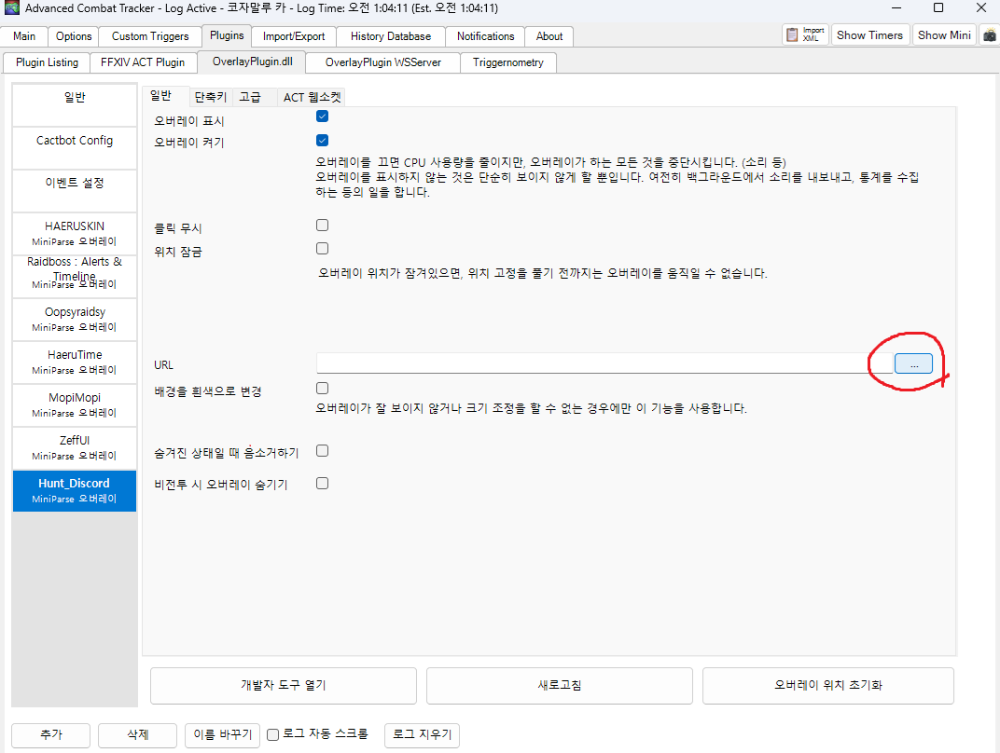

# FFXIV 황금 마물 디스코드 알림기

주의:

- 이 프로젝트는 아직 **충분한 검증이 끝나지 않은 프로토타입**입니다.
- 일부 지역, 일부 감지 상황, 일부 좌표/지도 보정은 완전하지 않을 수 있습니다.
- 실사용 전 반드시 직접 테스트해 주세요.

황금 지역 A/S급 마물을 발견했을 때:

- 디스코드 웹훅으로 알림 보내기
- 지역 / 좌표 표시하기
- 지도 이미지에 핀 찍어서 같이 보내기

를 해주는 로컬 실행형 프로그램입니다.

이 프로그램은 **사용자 PC에서 직접 실행**하는 방식입니다.  
릴리스 zip 안에는 필요한 실행 파일과 런타임이 같이 들어 있으므로, **Node.js를 따로 설치할 필요는 없습니다.**

중요:

- `start-live.bat`만 실행해서는 알림이 오지 않습니다.
- **프로그램 실행 + ACT 오버레이 등록**을 둘 다 해야 실제 마물 알림이 옵니다.
- 이유:
  - 프로그램 실행 = 디스코드 전송 서버 켜기
  - ACT 오버레이 등록 = 게임 로그를 서버로 보내기

ACT 등록 절차만 따로 보고 싶으면:

- [ACT 오버레이 등록 방법](./docs/act-overlay-setup.md)

## 1. JSON 설정 후 BAT으로 실행하는 방법

가장 쉬운 사용 방법입니다.

### 1-1. 파일 준비

릴리스 zip을 풀면 대략 이런 파일이 있습니다.

- `start-live.bat`
- `start-test.bat`
- `config/`
- `overlay/`

일반 사용자는 보통 `start-live.bat` 만 사용하면 됩니다.

### 1-2. 설정 파일 만들기

먼저 `config/local.config.example.json` 을 복사해서  
`config/local.config.json` 파일을 만듭니다.

예시:

```json
{
  "server": {
    "host": "127.0.0.1",
    "port": 5059
  },
  "identity": {
    "detectedBy": "무냥@초코보",
    "instanceLabel": ""
  },
  "discord": {
    "webhookUrl": "https://discord.com/api/webhooks/여기에_본인_웹훅"
  },
  "storage": {
    "recordsPath": "../data/records.jsonl",
    "imageOutputDir": "../data/images",
    "dedupeMinutes": 5
  }
}
```

여기서 꼭 바꿔야 하는 값:

- `identity.detectedBy`
  - 디스코드에 `감지:` 로 표시될 이름
  - 예: `무냥@초코보`
- `discord.webhookUrl`
  - 본인 디스코드 웹훅 주소

### 1-3. 실행

실제 마물 감지용:

```text
start-live.bat
```

테스트 몹 감지용:

```text
start-test.bat
```

BAT을 실행하면 내부적으로 프로그램이 켜집니다.

정상 실행되면 콘솔에 아래와 비슷하게 뜹니다.

```text
Starting live hunt notifier on port 5059...
Hunt notifier listening on http://127.0.0.1:5059
```

하지만 여기까지만 해서는 아직 알림이 오지 않습니다.  
아래 ACT 오버레이 등록까지 해야 합니다.

## 2. ACT에 등록해서 실제로 작동시키는 방법

이 단계가 빠지면 마물과 조우해도 알림이 안 옵니다.

즉 실제 사용 순서는:

1. `start-live.bat` 실행
2. ACT에서 브리지 오버레이 등록

입니다.

### 2-1. ACT에 브리지 등록

스크린샷 포함 상세 설명은 아래 문서를 보시면 됩니다.

- [ACT 오버레이 등록 방법](./docs/act-overlay-setup.md)

핵심만 요약하면:

1. `Plugins -> OverlayPlugin.dll -> 추가`
2. 이름은 예를 들어 `Hunt_Discord`
3. 프리셋 `커스텀`, 유형 `MiniParse`
4. URL에 `overlay/ingest-bridge.html` 등록
5. `오버레이 표시`, `오버레이 켜기` 체크

스크린샷 예시:

`Plugins -> OverlayPlugin.dll -> 추가`


`커스텀 / MiniParse` 선택 후 확인


URL 오른쪽 `...` 버튼으로 `overlay/ingest-bridge.html` 선택




`오버레이 표시`, `오버레이 켜기` 체크


정상 연결 화면 예시


URL 경로 예시:

```text
file:///C:/Users/Administrator/Downloads/ff14-discord-hunt-notify-win-x64-v0.1.0/overlay/ingest-bridge.html
```

정상 연결되면 브리지 오버레이에 아래와 비슷하게 표시됩니다.

```text
Bridge armed
Waiting for filtered log lines
```

## 디스코드에 오는 알림 예시

```text
[A급 발견] 네추키호
지역: 야크텔 밀림
좌표: X 12.4 / Y 13.6
감지: 무냥@초코보
```

추가로 지도 이미지와 핀도 함께 첨부됩니다.

## 꼭 알아둘 점

- 이 프로그램은 **ACT 로그를 받아서** 동작합니다.
- 그래서 **ACT + OverlayPlugin 등록**은 꼭 필요합니다.
- `BAT`은 프로그램 서버를 켜는 용도입니다.
- `ACT 오버레이 등록`은 게임 로그를 이 프로그램으로 넘기는 용도입니다.

즉 실제 사용에는 보통 아래 두 가지가 모두 필요합니다.

1. 프로그램 실행
2. ACT 오버레이 등록

한 줄 요약:

- `BAT만 실행` -> 서버만 켜짐, 알림 안 올 수 있음
- `ACT만 등록` -> 로그는 생기지만 받을 서버가 없음
- **둘 다 해야 실제 디스코드 알림이 옴**

---

## 개발자용

아래부터는 구조 설명, 테스트, 빌드, 개발 메모입니다.

## 프로젝트 개요

현재 구조는 다음 흐름으로 동작합니다.

1. OverlayPlugin 커스텀 오버레이가 게임 로그를 수집
2. 로컬 Node 서버가 `03 / 04 / 25 / 40 / 261` 로그를 파싱
3. 마물 테이블과 대조해 A/S급 여부를 판별
4. 월드 좌표를 인게임 맵 좌표로 변환
5. 디스코드 웹훅으로 텍스트 + 지도 핀 이미지를 전송

## 주요 기능

- A급 / S급 BNpcNameID 화이트리스트 기반 감지
- 일반 몹 / NPC를 이용한 테스트 모드
- 디스코드 웹훅 알림
- 지역명 / 맵 좌표 / 월드 좌표 기록
- Dawntrail 6개 지역 공식 지도 배경 합성
- 로컬 디버그 엔드포인트 제공

## 지원 지도

- 오르코 파차
- 코자말루 카
- 야크텔 밀림
- 샬로니 황야
- 헤리티지 파운드
- 리빙 메모리

## 폴더 구조

- `src/server.mjs`: HTTP 서버 엔트리
- `src/lib/parser.mjs`: ACT 로그 파서
- `src/lib/hunts.mjs`: 마물 매칭 로직
- `src/lib/projector.mjs`: 월드 좌표 -> 맵 좌표 / 픽셀 좌표 변환
- `src/lib/png-renderer.mjs`: 지도 이미지 렌더링
- `src/lib/discord.mjs`: 디스코드 웹훅 전송
- `overlay/ingest-bridge.html`: OverlayPlugin에서 불러올 커스텀 오버레이
- `config/local.config.example.json`: 실사용 설정 템플릿
- `config/hunts.as-whitelist.json`: A/S급 BNpcNameID 화이트리스트
- `config/tracked-targets.outrunner.json`: 일반 몹 테스트용 예시

## 테스트 방법

### 시뮬레이션 이벤트 테스트

```powershell
node src/server.mjs --config config/example.config.json --hunts config/hunts.sample.json
```

```powershell
Invoke-WebRequest http://127.0.0.1:5055/simulate/spawn `
  -Method POST `
  -ContentType 'application/json' `
  -InFile samples/simulated_spawn.json
```

### 일반 몹 테스트

예시 테스트 대상:

- 아웃러너
- 네크로시스

관련 설정 파일:

- `config/tracked-targets.outrunner.json`

## 디버그 명령

상태 확인:

```powershell
powershell -ExecutionPolicy Bypass -File scripts/debug-local-state.ps1
```

플레이어 좌표 확인:

```powershell
powershell -ExecutionPolicy Bypass -File scripts/debug-player.ps1
```

헬스 체크:

```powershell
Invoke-WebRequest http://127.0.0.1:5059/health | Select-Object -Expand Content
```

## 지도 자산

Dawntrail 공식 지도 배경은 아래 스크립트로 받을 수 있습니다.

```powershell
powershell -ExecutionPolicy Bypass -File scripts/download-official-dawntrail-maps.ps1
```

저장 위치:

- `maps/official`

## 설정 개요

`config/local.config.example.json` 기준으로:

- `server`: 로컬 서버 주소 / 포트
- `identity`: 감지자 이름, 인스턴스 표시값
- `discord`: 웹훅 설정
- `storage`: 기록 파일 / 이미지 출력 폴더 / 중복 제한 시간
- `parser`: ACT 로그 필드 인덱스
- `maps`: 지도별 좌표 변환 설정

## 마물 감지 방식

`config/hunts.as-whitelist.json` 에는:

- A급 BNpcNameID 화이트리스트
- S급 BNpcNameID 화이트리스트

가 들어 있습니다.

실제 디스코드에 표시되는 몹 이름은 고정 테이블명이 아니라, **실시간 로그의 `name` 값**을 사용합니다.  
즉 마물별 이름 사전이 없어도 실사용 가능한 알림을 만들 수 있습니다.

## 참고 사항

- 이 프로젝트는 로컬에서 실행되는 구조입니다.
- 중앙 서버형 서비스보다, ACT / OverlayPlugin 옆에서 같이 돌리는 도구에 가깝습니다.
- `config/local.config.json`, `data/` 등 로컬 민감 정보와 산출물은 git에서 제외되어 있습니다.

## 현재 상태

현재는 다음이 동작합니다.

- OverlayPlugin 브리지 수집
- A/S급 BNpcNameID 감지
- 일반 몹 테스트
- 리빙 메모리 / 야크텔 밀림 좌표 검증
- 실제 지도 배경 핀 렌더링
- 디스코드 웹훅 전송

추가로 다듬을 수 있는 부분:

- 지역별 핀 위치 미세보정
- `blockHunts`, `insHunts` 처리
- 더 쉬운 배포용 런처 / exe 패키징

## exe 릴리스 빌드

개발 PC에서 아래 스크립트로 배포용 exe + zip을 만들 수 있습니다.

```powershell
powershell -ExecutionPolicy Bypass -File scripts/build-release.ps1 -Version 0.1.0
```

생성 결과:

- `release/ff14-discord-hunt-notify-win-x64-v0.1.0/`
- `release/ff14-discord-hunt-notify-win-x64-v0.1.0.zip`

릴리스 zip 안에는 다음이 포함됩니다.

- `ff14-discord-hunt-notify.exe`: 내부 실행 런처
- `runtime/node.exe`: 번들된 Node 런타임
- `config/`, `maps/`, `overlay/`, `scripts/`: 실행에 필요한 파일

즉 최종 사용자는 **Node.js를 별도로 설치할 필요가 없습니다.**
