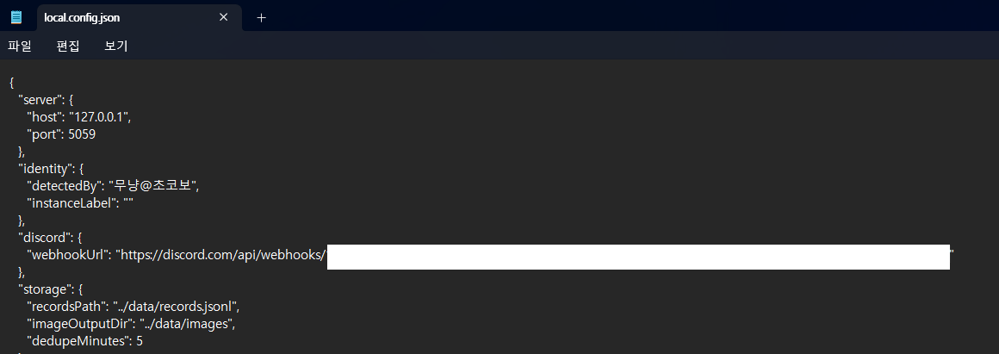
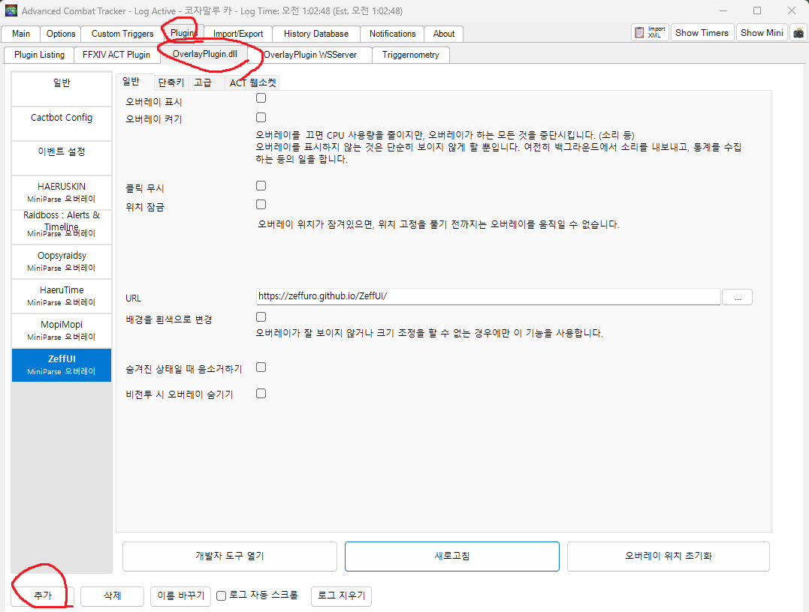
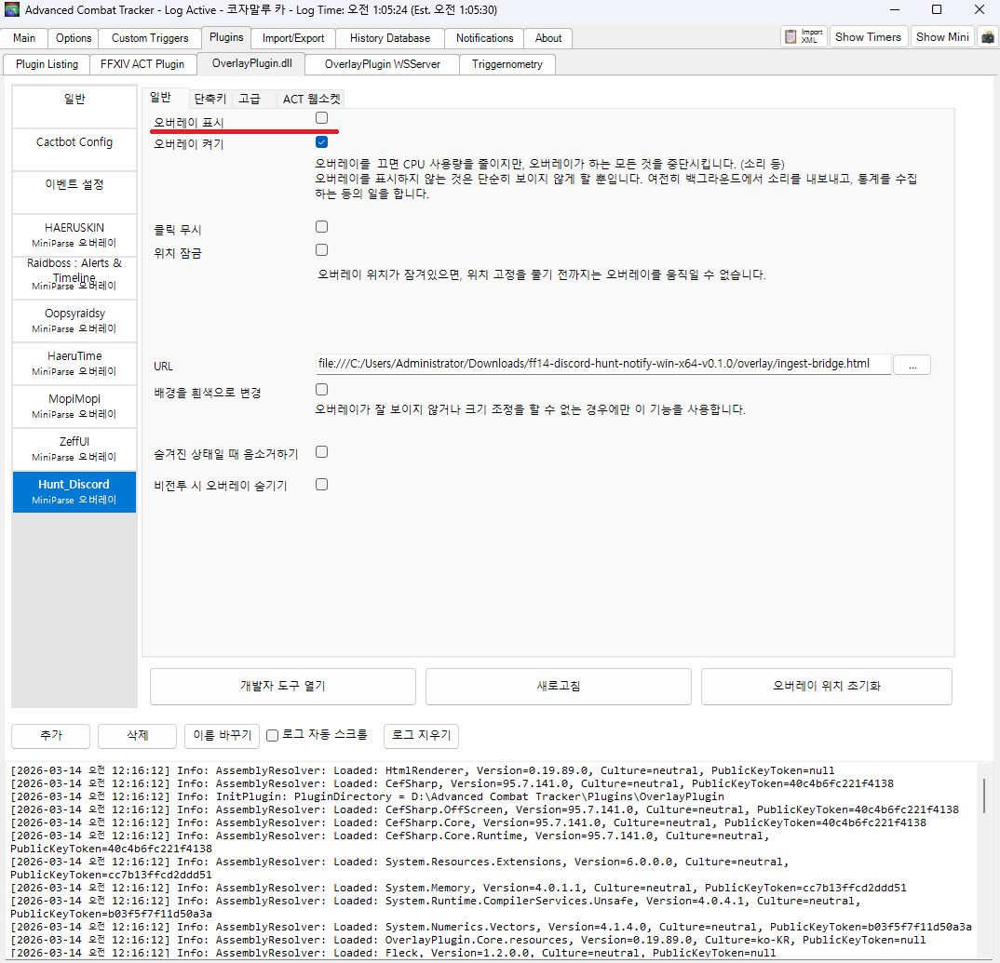

# ACT 오버레이 등록 방법

이 문서는 `ff14-discord-hunt-notify` 를 실제로 작동시키기 위해 필요한
ACT + OverlayPlugin 브리지 등록 절차를 따로 정리한 문서입니다.

중요:

- `start-live.bat` 실행만으로는 알림이 오지 않습니다.
- 반드시 **프로그램 실행 + ACT 오버레이 등록**을 둘 다 해야 합니다.

## 순서

1. `config/local.config.json` 작성
2. `start-live.bat` 실행
3. ACT에서 브리지 오버레이 등록

## 1. 프로그램 실행

먼저 `config/local.config.example.json` 을 복사해서  
`config/local.config.json` 파일을 만듭니다.

예시:



```text
start-live.bat
```

정상 실행되면 콘솔에 아래와 비슷하게 뜹니다.

```text
Starting live hunt notifier on port 5059...
Hunt notifier listening on http://127.0.0.1:5059
```

이 상태는 **서버만 켜진 상태**입니다.
아직 ACT 오버레이 등록을 안 하면 알림은 오지 않습니다.

## 2. ACT에서 브리지 오버레이 만들기

ACT에서:

1. `Plugins` 탭 클릭
2. `OverlayPlugin.dll` 선택
3. 왼쪽 아래 `추가` 버튼 클릭



새 오버레이 생성 창에서:

- 이름: `Hunt_Discord`
- 프리셋: `커스텀`
- 유형: `MiniParse`

그 다음 `확인`을 누릅니다.


## 3. 브리지 HTML 선택

생성된 오버레이를 선택한 뒤:

1. URL 오른쪽 `...` 버튼 클릭
2. 릴리스 폴더 안의 아래 파일 선택

```text
overlay/ingest-bridge.html
```


예시 경로:

```text
file:///C:/Users/Administrator/Downloads/ff14-discord-hunt-notify-win-x64-v0.1.0/overlay/ingest-bridge.html
```

## 4. 오버레이 켜기

다음 항목을 체크합니다.

- `오버레이 표시`
- `오버레이 켜기`



## 5. 정상 연결 확인

정상이라면 브리지 오버레이에 아래와 비슷하게 보입니다.

```text
Bridge armed
Waiting for filtered log lines
```

또는 다음 정보가 보일 수 있습니다.

- `PLAYER`
- `ZONE`
- `ENDPOINT`
- `FILTERS`


## 안 될 때

### BAT만 켠 경우

서버만 켜지고, 게임 로그가 들어오지 않아서 알림이 안 옵니다.

### ACT 오버레이만 등록한 경우

로그는 보일 수 있지만 디스코드로 전송할 서버가 없어서 알림이 안 옵니다.

### 오버레이 경로가 예전 폴더인 경우

릴리스 zip을 새 폴더에 풀었다면 URL도 새 경로여야 합니다.

### 브리지는 켜졌는데 알림이 안 오는 경우

아래 주소를 확인합니다.

```text
http://127.0.0.1:5059/health
http://127.0.0.1:5059/debug/recent
```
